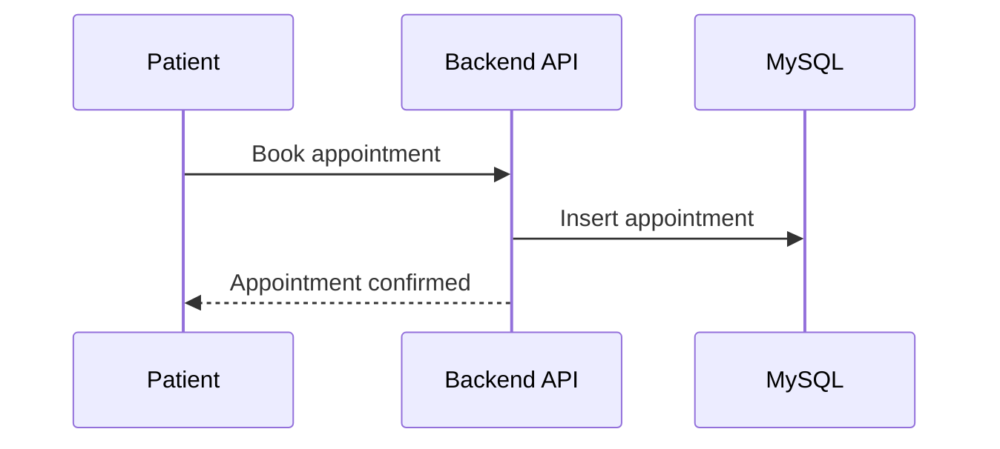
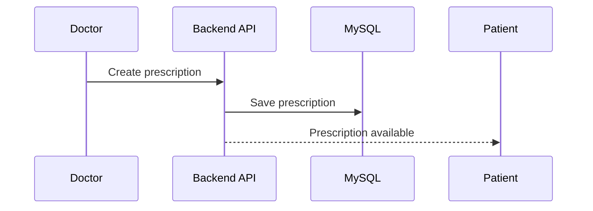

<div align="center">
  <h1>CritiCall Backend</h1>
  <p>PHP API for a multi-role healthcare platform: patients, doctors, pharmacists, and admins.</p>
  <p>
    
    
    
    
    
  </p>
  <p><strong>Built by Shashank Preetham Pendyala</strong></p>
</div>

---

## Overview

CritiCall Backend powers authentication, appointments, prescriptions, inventory, notifications, and administration for a multi-role healthcare platform. It is organized into role-based endpoints and includes email OTP flows, appointment reminders, and optional Jitsi consultation support.

---

## Table of Contents

- [Key Capabilities](#key-capabilities)
- [Roles](#roles)
- [Architecture](#architecture)
- [Repository Structure](#repository-structure)
- [Local Development](#local-development)
- [Environment Variables](#environment-variables)
- [API Modules](#api-modules)
- [API Examples](#api-examples)
- [Workflow Diagrams](#workflow-diagrams)
- [Deployment Guide](#deployment-guide)
- [Monitoring and Logging](#monitoring-and-logging)
- [Security Notes](#security-notes)
- [Troubleshooting](#troubleshooting)
- [FAQ](#faq)
- [License](#license)

---

## Key Capabilities

| Capability | Description |
| --- | --- |
| Auth + OTP | Email OTP flows for registration and password reset. |
| Appointment lifecycle | Booking, confirmation, completion, and resolution. |
| Pharmacy inventory | Stock updates and medicine requests. |
| Notifications | Multi-role notification delivery and read states. |
| Admin controls | Verification workflows and user management. |

---

## Roles

- **Patient**: booking, prescriptions, vitals, notifications.
- **Doctor**: availability, appointment management, prescriptions.
- **Pharmacist**: inventory and request fulfillment.
- **Admin**: verification and operational stats.

---

## Architecture


---

## Repository Structure

- `api/` PHP backend API
- `jitsi/` optional self-hosted Jitsi (if used in deployment)
- `uploads/` server-side uploads (runtime data)
- `vendor/` Composer dependencies
- `composer.json` and `composer.lock`
- `criticall.sql` schema (if present)

---

## Local Development

```bash
composer install
php -S 127.0.0.1:8080 -t api
```

Health check:

```bash
curl http://127.0.0.1:8080/health.php
```

---

## Environment Variables

Configure in `api/config.php` and mailer config:

- `DB_HOST`
- `DB_NAME`
- `DB_USER`
- `DB_PASS`
- `MAIL_HOST`
- `MAIL_USER`
- `MAIL_PASS`
- `JITSI_BASE_URL` (if used)
- `RAZORPAY_KEY_SECRET` (server-side)

---

## API Modules

- `api/auth/` registration, OTP, password reset
- `api/patient/` booking, prescriptions, vitals
- `api/doctor/` availability, appointments, prescriptions
- `api/pharmacist/` inventory and requests
- `api/admin/` verification and stats
- `api/notifications/` notification list and status
- `api/cron/` appointment reminders

---

## API Examples

**Login**

```http
POST /auth/login
```

**Book appointment**

```http
POST /patient/book_appointment
```

**Doctor completes appointment**

```http
POST /doctor/appointment_complete
```

**Pharmacist marks available**

```http
POST /pharmacist/requests_mark_available
```

---

## Workflow Diagrams

### Appointment Lifecycle



### Prescription Flow



---

## Deployment Guide

- Install dependencies with Composer
- Configure DB and SMTP in `api/config.php`
- Set up HTTPS (nginx or Apache)
- Ensure `uploads/` is writable if enabled
- Schedule `api/cron/appointment_reminders.php`

---

## Monitoring and Logging

- PHP error logs for backend failures
- Web server logs for request tracing
- Cron logs for reminder job outcomes

---

## Security Notes

- Keep DB and SMTP credentials out of source control.
- Enforce role checks on all endpoints.
- Validate uploads and restrict file size.
- Keep Razorpay secret server-side.

---

## Troubleshooting

- **500 errors**: verify DB credentials in `api/config.php`.
- **OTP emails not sending**: check SMTP settings in `api/mailer.php`.
- **Health check fails**: confirm PHP server root points to `api/`.

---

## FAQ

**Is Jitsi required?**

No. The API can return external meeting links and Jitsi is optional.

**Do you store payment secrets in the app?**

No. Payment secrets are handled server-side.

---

## License

MIT License. See `LICENSE`.
